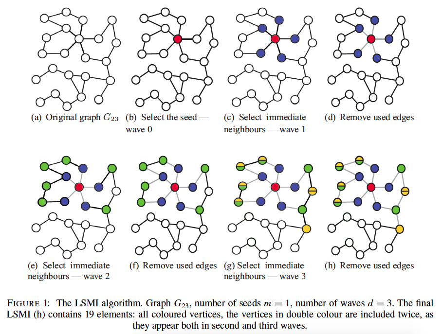

# Random graph stuff

## Preliminaries and notation

- A graph $G$ is a mathematical object that consists of a set of vertices (nodes), $V(G)$ and a set of edges (links), $E(G)$. Let $e_{ij} \in E(G)$ denote the edge between vertices $i, j \in V(G)$.
- Throughout, $n = |V(G)|$ is the number of vertices in $G$ and  $e = |E(G)|$ the number of edges.
- The *degree* of vertex $i \in V(G)$, $d_i$ is the number of edges that are connected to vertex $i$.
- We consider *undirected* ($e_{ij} = e_{ji}$) and *loopless* ($i \not= j \forall e_{ij} \in E(G)$) graphs.
- The distance $dist(i, j)$ is the minimum number of edges in a connected path from $i$ to $j$ in $G$.
- The $d$th order neighborhood of a vertex $i \in V(G)$ is defined as $N_d(u, G) = \{j \in V(G): dist(i, j) \le d\}$

## Neighborhoods

d = 
<select id="choose_d">
  <option value="1" selected="selected">1</option>
  <option value="2">2</option>
</select>

[@martin2011dance, @cukier2012got]

## Network inference
A complete description of a network and its topology is infeasible $\Rightarrow$ we can study the statistics of a complex network (i.e., clustering coeffients, numbers of triangles, average degree, etc.)

Let 

- $G$ be a hypothetical undirected random graph,
- $F = \{f(k), k \ge 0\}$ the degree distribution of $G$,
- $G_n$ be an observed realization of $G$ of order $n$ s.t. as $n \rightarrow \infty$, the joint degree distributions of $G_n$ approach the joint degree distribution of $G$.
- $d_1, \dots, d_n$ be the observed degrees of the vertices in $G_n$.
 
 **Goal**: Estimate the population mean degree of $G$, $\mu(G)$ using a block boostrap.

# A snowball's chance...

## Overview

Labelled Snowball with Multiple Inclusions

## Algorithm

**Data**: graph $G_n$; number of seeds $m$, $m < n$; number of waves $d$  
**Result**: sample of $m$ seeds with $d$ waves around each seed.  
*seed* $=$ randomly sample without replacement $m$ vertices from $G_n$  
**for** $q = 1, \dots, m$ **do**  
&nbsp;&nbsp;&nbsp;&nbsp;start with original $G_n$ and $seed_q$  
&nbsp;&nbsp;&nbsp;&nbsp;**for** $w = 1, \dots, d$ **do**  
&nbsp;&nbsp;&nbsp;&nbsp;&nbsp;&nbsp;&nbsp;&nbsp;$wave_w =$ select all immediate neighbors using the existing edges  
&nbsp;&nbsp;&nbsp;&nbsp;&nbsp;&nbsp;&nbsp;&nbsp;remove the used edges  
&nbsp;&nbsp;&nbsp;&nbsp;**end**  
&nbsp;&nbsp;&nbsp;&nbsp;$patch_q =$ join the current $seed_q$ and all $wave_w$ keeping the repeated elements  
**end**  
join all $m$ patches, keeping all of the repeated elements

## Illustration

[@thompson2016using]

## Properties

# A simpler idea

## Overview

## Algorithm

## Properties

# Simulated examples

<link rel="stylesheet" href="https://ajax.googleapis.com/ajax/libs/jqueryui/1.11.4/themes/smoothness/jquery-ui.css">
<link rel="stylesheet" type="text/css" href="style/d3.css">

## References